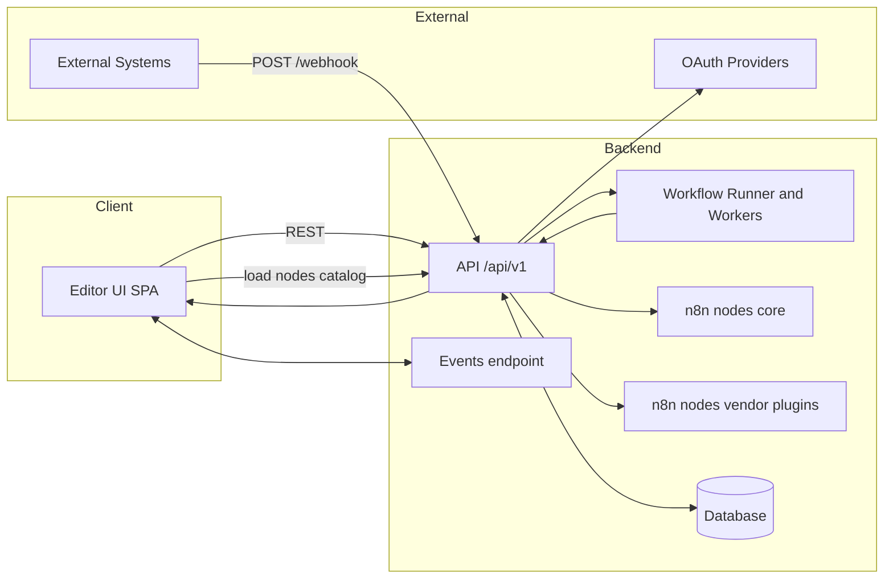
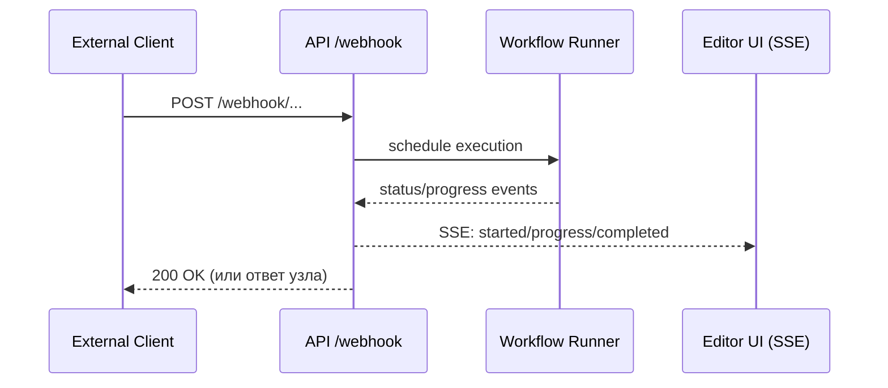

# EPIC: Разделение UI/API и модульность узлов в n8n

## Техническое задание (ТЗ)
- Проанализировать репозиторий n8n (`https://github.com/n8n-io/n8n`) и предложить план по:
  - разделению фронтенда и бэкенда;
  - исключению интеграционных узлов из сборки.
- Ожидаемый результат:
  - Краткий анализ текущей архитектуры и точек взаимодействия фронта и бэка — см. [Анализ](../ui-api-separation.md#1-анализ-текущей-архитектуры) и [Техническое описание результата](#техническое-описание-результата-что-получится).
  - План разделения фронтенда и бэкенда (варианты: выделение API в отдельный сервис, SSR vs SPA, отдельная сборка фронта) — см. [План разделения](../ui-api-separation.md#2-план-разделения-фронтенда-и-бэкенда), [Мильстоун 1](#мильстоун-1-изоляция-backend-api), [Мильстоун 2](#мильстоун-2-отделение-frontend-spa).
  - Предложения по исключению интеграционных узлов из сборки, влияние на архитектуру — см. [Исключение узлов](../ui-api-separation.md#3-исключение-интеграционных-узлов-из-сборки) и [Мильстоун 3](#мильстоун-3-модульность-узлов-nodes).
  - Декомпозиция на конкретные подзадачи — см. [Мильстоун 1–6](#мильстоун-1-изоляция-backend-api).
  - Экспресс-оценка сроков (в часах/днях) — см. [Итоги по оценке](#итоги-по-оценке) и [Экспресс‑оценка](../ui-api-separation.md#5-экспресс-оценка).

## Цели
- Отделить фронтенд (Editor UI) от бэкенда (API/вебхуки/воркеры).
- Ввести версионированный API (/api/v1) с CORS и унифицированной аутентификацией.
- Исключить интеграционные узлы из базовой сборки, внедрить плагинную модель.

## Область работ (Scope)
- Backend (packages/cli): маршрутизация, CORS, events (SSE/WS), загрузчик узлов.
- Frontend (packages/frontend/editor-ui): базовый URL API, каталог узлов из API.
- DevOps/CI: отдельные образы UI и API, матрица интеграционных пакетов.
- Документация и миграция.

## Вне области (Out of Scope)
- Полная переработка редактора.
- Добавление новых интеграций (кроме выделения в пакеты).

---

## Мильстоун 1: Изоляция Backend API
- [TASK] Перестать отдавать статику UI из `packages/cli`
  - [SUBTASK] Удалить/зафичафлагать `express.static` и history API handler для UI.
  - [SUBTASK] Сохранить non-UI маршруты: `/webhook*`, `/oauth*`, `/events`.
  - Acceptance: запуски/вебхуки работают, UI не обслуживается сервером.
  - ETA: 8–12 ч.
- [TASK] Ввести префикс `/api/v1` и CORS
  - [SUBTASK] Сконфигурировать `ALLOWED_ORIGINS`, `CORS_CREDENTIALS`.
  - [SUBTASK] Обновить маршруты контроллеров под `/api/v1/*`.
  - Acceptance: кросс-доменные запросы из UI проходят, preflight ок.
  - ETA: 12–16 ч.
- [TASK] Events endpoint
  - [SUBTASK] Перенести SSE/WS на `/api/v1/events`.
  - [SUBTASK] Обновить push-слой и конфиг.
  - Acceptance: статусы/прогресс доставляются в UI.
  - ETA: 8–12 ч.
- [TASK] OpenAPI/Swagger
  - [SUBTASK] Сгенерировать/описать основные эндпоинты.
  - Acceptance: доступен Swagger UI, схема валидна.
  - ETA: 8–12 ч.

## Мильстоун 2: Отделение Frontend (SPA)
- [TASK] Базовый URL API в UI
  - [SUBTASK] Ввести `VITE_API_BASE_URL`, заменить относительные пути.
  - [SUBTASK] Включить `credentials` для cookie-стратегии.
  - Acceptance: UI работает против отдельного API, dev proxy ок.
  - ETA: 8–12 ч.
- [TASK] Каталог узлов из API
  - [SUBTASK] Добавить загрузку `/api/v1/nodes/catalog`.
  - [SUBTASK] Спрятать недоступные узлы, обработать пустые состояния.
  - Acceptance: список узлов в UI соответствует серверу.
  - ETA: 12–16 ч.
- [TASK] Сборка и поставка UI отдельно
  - [SUBTASK] Dockerfile.ui (build → Nginx).
  - Acceptance: UI отдается как статика, конфигурируемый `BASE_PATH`.
  - ETA: 6–10 ч.

## Мильстоун 3: Модульность узлов (nodes)
- [TASK] Разбить `nodes-base` на core и интеграции
  - [SUBTASK] Создать `n8n-nodes-core` (базовые узлы).
  - [SUBTASK] Выделить 5–10 интеграций в пакеты `n8n-nodes-<vendor>`.
  - [SUBTASK] Перевести SDK в `peerDependencies`.
  - Acceptance: базовый образ без интеграций, интеграции подключаемы.
  - ETA: 32–56 ч.
- [TASK] Загрузчик с allowlist/denylist
  - [SUBTASK] Env `N8N_INCLUDED_NODES`/`N8N_EXCLUDED_NODES`.
  - [SUBTASK] Манифест `nodes-index.json` на билд-этапе.
  - Acceptance: сервер поднимается только с разрешёнными узлами.
  - ETA: 16–24 ч.
- [TASK] Endpoint каталога узлов
  - [SUBTASK] `/api/v1/nodes/catalog` (название, версия, категории, креды).
  - Acceptance: UI корректно отражает набор узлов.
  - ETA: 8–12 ч.

## Мильстоун 4: DevOps и CI/CD
- [TASK] Два образа: `n8n-api:core` и `n8n-ui`
  - [SUBTASK] Dockerfile.api (multi-stage, без интеграций по умолчанию).
  - [SUBTASK] Compose/K8s (раздельные Deployments/Services/Ingress).
  - Acceptance: окружение с двумя сервисами, CORS/ingress настроен.
  - ETA: 12–20 ч.
- [TASK] Матрица интеграций
  - [SUBTASK] Параллельные билды `n8n-nodes-<vendor>`.
  - [SUBTASK] Публикация артефактов/образов, кеш зависимостей.
  - Acceptance: успешные матричные сборки, уместные размеры образов.
  - ETA: 12–20 ч.

## Мильстоун 5: Миграция и совместимость
- [TASK] Обработка отсутствующих узлов в воркфлоу
  - [SUBTASK] UI помечает отсутствующие узлы, предлагает установить пакет.
  - Acceptance: воркфлоу открывается, пользователю ясно, что делать.
  - ETA: 8–12 ч.
- [TASK] OAuth редиректы и куки между доменами
  - [SUBTASK] SameSite=None; Secure, корректные redirect_uri.
  - Acceptance: все OAuth‑потоки работают при split‑домэйнах.
  - ETA: 6–10 ч.

## Мильстоун 6: Тесты и документация
- [TASK] E2E (core сценарии)
  - [SUBTASK] CRUD workflow, запуск, вебхуки, push‑статусы.
  - Acceptance: зелёные e2e в CI.
  - ETA: 12–20 ч.
- [TASK] Документация
  - [SUBTASK] Гайд по split‑деплою (CORS, домены, auth).
  - [SUBTASK] Инструкция по узлам (env, манифест, плагины).
  - Acceptance: docs полные, проверены по чек‑листу.
  - ETA: 8–12 ч.

## Риски и смягчения
- Аутентификация/CORS (кросс-доменные куки, preflight, CSRF)
  - Мера: строгий allowlist CORS, `credentials` только к доверенным origin, CSRF‑токены/DSC, e2e вход/выход.
- OAuth редиректы между доменами UI/API
  - Мера: централизованный конфиг `redirect_uri`, SameSite=None; Secure; чек‑лист провайдеров, автотест OAuth‑потоков.
- SSE/WebSocket за прокси/Ingress (обрывы, таймауты, sticky)
  - Мера: SSE по умолчанию, keep‑alive/таймауты, sticky‑sessions, health‑пробы.
- Версионный разъезд UI↔API после `/api/v1`
  - Мера: SemVer, контрактные тесты, feature‑флаги/градация возможностей, canary‑деплой UI.
- Рефактор путей (`/rest/*` → `/api/v1/*`) ломает ссылки/скрипты
  - Мера: временные редиректы/alias, массовый grep‑фикс, линтер ссылок в CI.
- Разбиение `nodes-base` (циклы импортов, общие типы, сборка)
  - Мера: слой общих типов, независимые пакеты, инкремент: 5–10 интеграций сначала.
- `peerDependencies` у узлов (нет SDK в рантайме)
  - Мера: проверка зависимостей при старте, установщик плагинов, матричные CI‑сборки.
- Лицензии сторонних SDK
  - Мера: OSS policy‑чек, SPDX‑скан, allowlist лицензий.
- Миграция воркфлоу с недоступными узлами
  - Мера: пометка в UI “узел недоступен”, подсказка “установите пакет”, миграционные скрипты.
- Безопасность плагинов (supply‑chain)
  - Мера: подпись/верификация пакетов, изоляция/сандбокс, скан зависимостей.
- Размер и холодный старт образов API/UI
  - Мера: базовый `api:core`, отдельные образы узлов, multi‑stage, кэш слоёв.
- Консистентность каталога узлов UI vs рантайм
  - Мера: источник правды — API `/api/v1/nodes/catalog`, кэш‑инвалидация/версии.
- Производительность вебхуков/исполнений после сплита
  - Мера: нагрузочное тестирование, connection pool, горизонтальное масштабирование.
- Нестабильность e2e при раздельных доменах
  - Мера: стабильные фикстуры, ретраи, локальный `docker-compose` окружения.
- Обратная совместимость community‑узлов
  - Мера: compat‑layer, план депрекации, ченджлог/гайд для авторов узлов.

## Итоги по оценке
- Суммарно: ~122–222 ч (≈ 3–5,5 недель при 40 ч/нед.).

## Техническое описание результата (что получится)

- Backend (API/Workers)
  - Эндпоинты и протоколы:
    - REST API под префиксом `/api/v1/*` (CRUD воркфлоу, креды, исполнения, проекты и т.д.).
    - Вебхуки: `/webhook/*`, тестовые вебхуки: `/webhook-test/*` (без префикса, для совместимости).
    - OAuth callback’и: `/oauth*` (например, `/oauth2-credential/callback`), домены/пути согласованы с UI.
    - События (статусы, прогресс): `/api/v1/events` — SSE по умолчанию, WS опционально.
    - OpenAPI/Swagger: `/api-docs` (UI) и `/api-json` (схема).
  - Конфигурация окружения (ключевое):
    - `ALLOWED_ORIGINS`, `CORS_CREDENTIALS=true|false`, `N8N_BASE_URL`.
    - `AUTH_STRATEGY=cookie|bearer`, при cookie: `COOKIE_DOMAIN`, `SESSION_SECURE=true`, CSRF‑защита.
    - Узлы: `N8N_INCLUDED_NODES`, `N8N_EXCLUDED_NODES`, `N8N_NODES_MANIFEST_PATH`.
    - Push: `N8N_PUSH_BACKEND=sse|ws`.
  - Загрузчик узлов:
    - Всегда подключает `n8n-nodes-core`.
    - Опционально обнаруживает пакеты `n8n-nodes-*` в `node_modules` и фильтрует по include/deny‑листам.
    - Формирует каталог узлов (название, версия, категории, требования к кредам) и отдаёт по `/api/v1/nodes/catalog`.
  - Безопасность/прочее:
    - CORS‑allowlist с credentials, CSRF для cookie‑режима, security headers.
    - Rate limiting/DoS‑защита на вебхуках и публичных эндпоинтах.
    - Метрики/логи остаются как есть (Prometheus, структурированные логи stdout).

- Frontend (Editor UI SPA)
  - Сборка: Vite (SPA), статика отдаётся отдельным веб‑сервером (например, Nginx/CDN).
  - Конфиги:
    - `VITE_API_BASE_URL=https://api.example.com/api/v1`.
    - `VITE_EVENTS_URL=https://api.example.com/api/v1/events` (опц., иначе строится из `VITE_API_BASE_URL`).
    - Sentry/телеметрия через соответствующие `VITE_*` переменные.
  - Поведение:
    - Все запросы к API идут на внешний домен, включён `credentials` при cookie‑аутентификации.
    - Каталог узлов запрашивается на старте у `/api/v1/nodes/catalog` — UI показывает только доступные узлы, недостающие помечает.
    - Подписка на события через SSE по `/api/v1/events`.
  - Dev‑режим:
    - Vite proxy `/api` → `http://localhost:5678` или прямой CORS к API; `.env.development` с базовыми переменными.

- DevOps
  - Контейнеры:
    - `Dockerfile.api` — multi‑stage, минимальный образ c `n8n-nodes-core` (интеграции подключаются отдельно).
    - `Dockerfile.ui` — сборка UI и отдача через Nginx (или иной статик‑сервер/CDN).
  - docker‑compose:
    - Сервисы `api` и `ui`, переменные окружения CORS/Auth, проксирование портов, опционально Traefik/Nginx labels.
  - Kubernetes:
    - `Deployment`/`Service` для `api` и `ui`, `Ingress` с хостами `app.example.com` и `api.example.com`.
    - Пробы: liveness/readiness на API, кеширование статики на UI.
    - HPA/автомасштабирование для API по CPU/RAM/latency, sticky‑sessions при WS (если включён).
  - CI/CD:
    - Отдельные пайплайны билдов `api` и `ui`, публикация артефактов и образов с тегами `semver` и `sha`.
    - Матрица сборок для интеграционных пакетов `n8n-nodes-*`, security scan (SCA), кеш зависимостей.
  - Наблюдаемость:
    - Метрики Prometheus (если включено), централизованные логи, Sentry для UI.

## Диаграммы архитектуры

Системная схема (взаимодействие UI, API, воркеров, вебхуков и внешних провайдеров):

Последовательность обработки вебхука и доставки статусов в UI:

## Готовность к поставке (DoD)
- API работает отдельно, UI собирается и деплоится отдельно.
- Узлы core доступны без интеграций, интеграции подключаемы через пакеты/env.
- E2E зелёные, документация обновлена, DevOps пайплайны стабильны.

